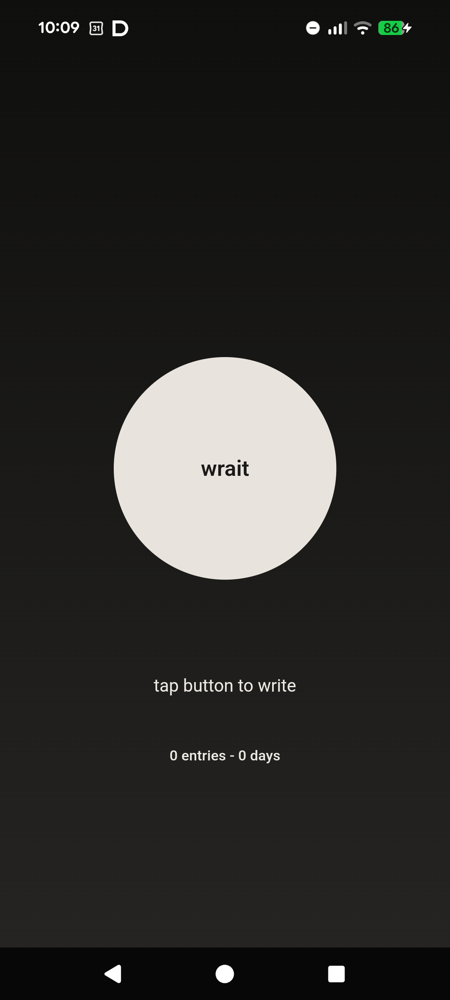

# wrait

*One button. Your voice. Your words. Kept private by design.*

wrait is a minimal voice diary for Android and iOS. Open the app, tap the
button, speak, tap again, and wrait turns the recording into a diary entry.
Entries are stored locally on your device in an encrypted database.

This repository contains the Flutter mobile client.

---

## What It Does

wrait records short spoken diary entries, sends the recording to the configured
wrait backend for transcription, sends the raw transcript back to the backend
for cleanup, and saves the result locally on the device.

The current Flutter app includes:

- one-button voice recording
- cloud-backed transcription and transcript cleanup through the wrait backend
- encrypted local entry storage
- retryable local drafts when backend work cannot finish immediately
- entry list and entry detail screens
- entry editing, sharing, and deletion
- CSV export and import from the entries screen
- app-wide privacy lock using device authentication
- Android screenshot, screen recording, and recent-app protection
- iOS background/app-switch privacy cover
- Android and iOS app branding



---

## Privacy Model

### What stays on your device

- Saved diary entries, including raw transcript and cleaned text
- Draft entries waiting for retry
- The encrypted local database key
- The app's anonymous device identifier after it is generated
- CSV exports that you explicitly create

### What leaves your device

The current Flutter app uses the configured wrait backend for the main
recording flow:

1. Voice audio is sent to `/api/transcribe` for speech-to-text processing.
2. Raw transcript text is sent to `/api/cleanup` for readability cleanup.
3. An anonymous device ID is sent to `/api/register` on launch and with backend
   requests.

The cleaned diary entry is not sent back to wrait-operated servers by the app.
It is stored locally after cleanup completes.

For the full disclosure, see [PRIVACY.md](PRIVACY.md).

---

## Backend

The mobile client talks to a backend compatible with the checked-in OpenAPI
contract:

- Source of truth: [api/wrait-backend.yaml](api/wrait-backend.yaml)
- Default backend URL: `https://wrait-backend.vercel.app`
- Runtime configuration keys:
  - `BACKEND_URL`
  - `PROXY_SECRET`
  - `RECORDING_HARD_CAP_MS`

Backend client code is generated locally during project bootstrap and is not
committed to this repository.

---

## Building From Source

### Requirements

- Flutter `3.44.3`
- Dart SDK compatible with `^3.12.2`
- Xcode for iOS builds
- Android Studio and Android SDK for Android builds
- Node.js and npm for OpenAPI client generation

### Setup

```sh
git clone https://github.com/santik/wrait.git
cd wrait
npm install
npm run build
flutter pub get
```

### Common Checks

```sh
flutter analyze
flutter test
flutter build apk --debug
```

For Android real-device debug and release deployment details, see
[docs/development.md](docs/development.md).

---

## Architecture

The Flutter app follows a layered structure:

```text
lib/
  core/          runtime config, router, time helpers
  data/          API, audio, auth, entry, preferences, launch infrastructure
  domain/        models, repositories, services, use cases
  presentation/  app lock, entries, main screen, theme, UI controllers
```

Important implementation boundaries:

- `api/wrait-backend.yaml` is the backend contract source of truth.
- `lib/data/api/generated/backend_api_generated.dart` is the stable bridge over
  the generated backend package.
- The encrypted local entry database is `wrait_entries_v2.sqlite`.
- Android release package ID is `com.wrait.flutter`.
- Android debug/profile package ID is `com.wrait.flutter.dev`.
- iOS bundle ID is `com.wrait.app`.

---

## Tester Guide

See [BETA_TESTER_GUIDE.md](BETA_TESTER_GUIDE.md) for install notes, suggested
test flows, privacy expectations, and known rough edges.

---

## License

MIT. See [LICENSE](LICENSE).

---

*wrait - speak your mind. keep it private.*
